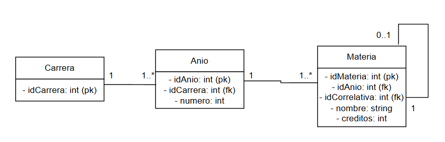

# Modelo de datos

El modelo representa el plan de estudios de una carrera universitaria. Se compone de tres entidades:

- **Carrera**: la carrera universitaria (ej. Ingeniería en Informática).
- **Anio**: cada uno de los años que componen una carrera.
- **Materia**: cada materia de la carrera, que pertenece a un año y puede tener una materia correlativa.

Cada entidad se mapea a una tabla de la base de datos. Los atributos marcados como `pk` son la clave primaria de la tabla; los marcados como `fk` son claves foráneas que referencian la clave primaria de otra tabla.

- Nota: En este modelo, no implementé la posibilidad de materias básicas. Las materias básicas (Química General, Cálculo I, Cálculo II, Álgebra y Geometría Analítica, Álgebra Lineal, Análisis Numérico, etc) son aquellas que son comunes a todas las carreras de ingeniería. Las carreras, en este modelo, **no comparten materias** entre sí.

## Entidades

### Carrera

| Columna      | Tipo    | Restricciones       | Descripción                       |
| ------------ | ------- | ------------------- | --------------------------------- |
| `id_carrera` | Integer | PK, autoincremental | Identificador único de la carrera |
| `nombre`     | String  | NOT NULL            | Nombre de la carrera              |

### Anio

| Columna      | Tipo    | Restricciones                       | Descripción                       |
| ------------ | ------- | ----------------------------------- | --------------------------------- |
| `id_anio`    | Integer | PK, autoincremental                 | Identificador único del año       |
| `numero`     | Integer | NOT NULL                            | Número de año (1, 2, 3, ...)      |
| `id_carrera` | Integer | FK → `carrera.id_carrera`, NOT NULL | Carrera a la que pertenece el año |

### Materia

| Columna          | Tipo    | Restricciones                   | Descripción                                        |
| ---------------- | ------- | ------------------------------- | -------------------------------------------------- |
| `id_materia`     | Integer | PK, autoincremental             | Identificador único de la materia                  |
| `nombre`         | String  | NOT NULL                        | Nombre de la materia                               |
| `creditos`       | Integer | NOT NULL                        | Créditos que otorga la materia una vez es aprobada |
| `id_anio`        | Integer | FK → `anio.id_anio`, NOT NULL   | Año al que pertenece la materia                    |
| `id_correlativa` | Integer | FK → `materia.id_materia`, NULL | Materia correlativa (opcional)                     |

## Relaciones

| Relación          | Cardinalidad | Descripción                                                                        |
| ----------------- | ------------ | ---------------------------------------------------------------------------------- |
| Carrera → Anio    | 1 : 1..\*    | Una carrera tiene uno o más años. Cada año pertenece a una sola carrera.           |
| Anio → Materia    | 1 : 1..\*    | Un año tiene una o más materias. Cada materia pertenece a un solo año.             |
| Materia → Materia | 0..1 : 1     | Una materia puede tener una correlativa (otra materia). Relación auto-referencial. |
